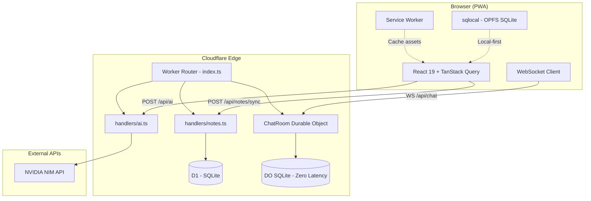
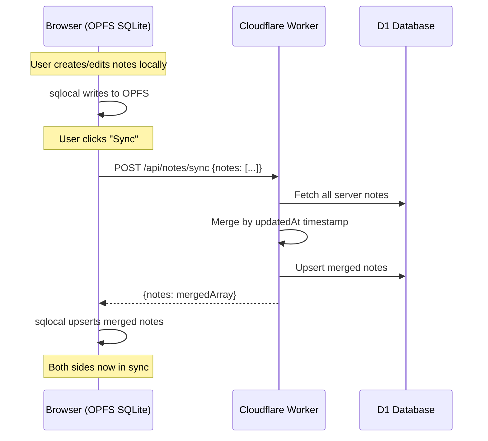
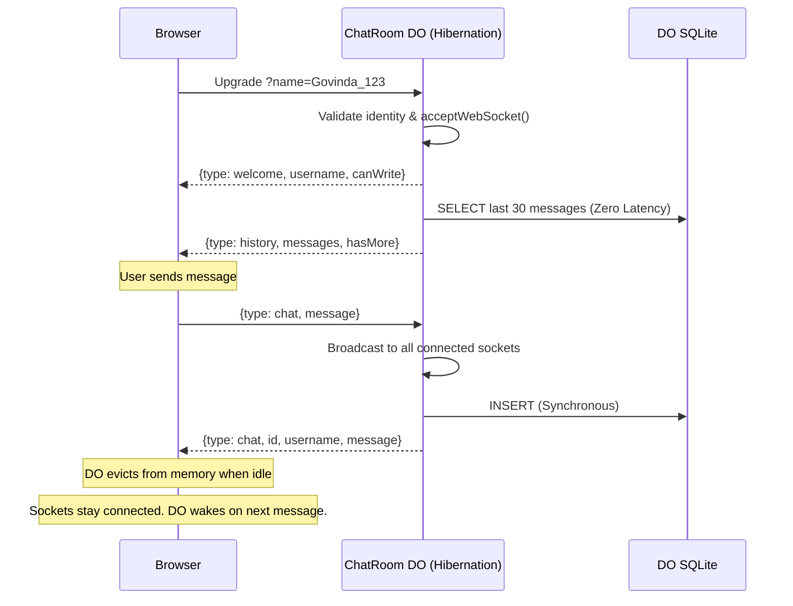

<p align="center">
  <strong>⚡ Buggy</strong><br>
  <em>Blazing-fast, offline-first PWA utilities built for the edge</em>
</p>

<p align="center">
  
  
  
  
  
  
  
</p>

---

## What Is Buggy?

**Buggy** is a Progressive Web App containing 8 high-performance utilities — from a simple light weight Nepali Calender to a AI chat with live streaming — all running offline-first on the client and syncing to Cloudflare's global edge network when needed.

Built by **Shreyam Adhikari** ([@shreyam1008](https://github.com/shreyam1008)).

---

## Features

| Feature | Description | Stack |
|---------|-------------|-------|
| 📅 **Date Converter** | Convert between Nepali BS and English AD dates with auto-formatting | Pure math engine, zero API |
| 🗓️ **Nepali Calendar** | Full month grid with BS ↔ AD overlay per cell | Client-side only |
| 🖼️ **Image Compressor** | JPEG/PNG/WebP compression via Web Workers | `browser-image-compression` |
| 📄 **PDF Merger** | Merge PDFs + images into one document | `pdf-lib` (lazy-loaded) |
| 📝 **Notes** | Local SQLite (OPFS) + cloud sync to D1 | `sqlocal` + Cloudflare D1 |
| 🔒 **Bcrypt** | Generate and verify bcrypt hashes | `bcryptjs` (client-only) |
| ✨ **AI Studio** | Chat with LLMs (streaming SSE) + image generation | NVIDIA NIM API proxy |
| 💬 **Live Chat** | Real-time global WebSocket| Cloudflare Workers WebSocket |

---

## Architecture

### High-Level System Diagram



### Data Flow: Notes Sync



### Data Flow: Live Chat (WebSocket Hibernation)



---

## Performance Philosophy

### Build Pipeline

```
Source (TypeScript + TSX)
  │
  ├─ Bun          — Package manager (3x faster than npm)
  ├─ Vite 8       — Dev server with instant HMR via native ESM
  ├─ Rollup       — Production bundler with tree-shaking
  ├─ OXC          — Linting (500x faster than ESLint via Rust)
  └─ Tailwind v4  — Zero-runtime CSS via @theme variables
```

### Code Splitting Strategy

Every page is `React.lazy()` loaded. Heavy dependencies are isolated into manual chunks:

| Chunk | Size (gzip) | Contents |
|-------|-------------|----------|
| `vendor-react` | 57 KB | React 19 + React DOM |
| `vendor-pdf` | 161 KB | pdf-lib (loaded only on /pdf) |
| `vendor-sqlite` | 7 KB | sqlocal (loaded only on /notes) |
| `index` (shell) | 3.3 KB | App router + Sidebar |
| Per-page chunks | 1.9–3.7 KB | Each utility page |

**Total initial load: ~60 KB gzipped** (React + shell only). Everything else loads on demand.

### Zero Re-render Architecture

| Pattern | Where | Why |
|---------|-------|-----|
| `useRef` for WebSocket | `useLiveChat.ts` | Avoids stale closures, stable callbacks with zero deps |
| `memo(DeletableBubble)` | `ChatRoom.tsx` | Only the deletable msg re-renders its countdown timer |
| No-op `Set` guards | `useLiveChat.ts` | If typists didn't change, return same reference → no render |
| `TanStack Query` | `Notes.tsx`, `AI.tsx` | Declarative cache invalidation, no manual loading states |

### PWA Capabilities

- **29 precached entries** via Workbox `generateSW`
- **Offline-first**: Date Converter, Calendar, Image Tools, PDF Merger, Bcrypt all work with zero network
- **Dynamic viewport**: `100dvh` layouts prevent mobile keyboard jump
- **GPU-only animations**: `transform` + `opacity` only → compositor thread, zero paint

---

## Worker Architecture

```
worker/src/
├── index.ts              # Edge router (~100 lines)
│   ├── Routes table      # Regex pattern matching
│   ├── D1 migrations     # notes + live_chat + idx_chat_time
│   └── CORS middleware   # Strict origin whitelisting
├── handlers/
│   ├── notes.ts          # Sync engine (UPSERT by updatedAt)
│   └── ai.ts             # NVIDIA NIM proxy (SSE streaming)
├── ChatRoom.ts           # Durable Object (WebSocket Hibernation)
│   ├── Colocated SQLite  # Zero-latency storage for messages
│   ├── serializeAttachment # State persistence across hibernation
│   └── Broadcast logic   # Single-point-of-coordination
└── utils/
    └── response.ts       # JSON helper + CORS headers
```

---

## Dark/Light Mode

The manual theme toggle in the sidebar uses `localStorage('buggy-theme')` and applies the `.dark` class to `<html>`. Tailwind v4 requires an explicit override for class-based dark mode:

```css
@custom-variant dark (&:where(.dark, .dark *));
```

All 8 pages have been audited for proper `dark:` variant coverage — every input, card, border, and text element has both light and dark colors.

---

## SEO & Crawlers

- Rich JSON-LD structured data for **Shreyam Adhikari**
- Open Graph + Twitter Card meta tags
- `sitemap.xml` with all utility routes
- **AI crawlers blocked**: GPTBot, ChatGPT-User, CCBot, Google-Extended, Anthropic-ai, Claude-Web, Omgili

---

## Local Development

```bash
# Prerequisites: Bun, Wrangler CLI

# Frontend
cd frontend
bun install
bun run dev          # Vite dev server on :5173

# Worker
cd worker
npx wrangler dev     # Local Workers runtime on :8787
```

### Environment Variables

| Variable | Where | Purpose |
|----------|-------|---------|
| `VITE_API_URL` | `frontend/.env` | Cloudflare Worker URL |
| `AI_API_KEY` | Wrangler secret | NVIDIA NIM API key |

---

## My Other Apps

- 🖥️ [dbterm](https://shreyam1008.github.io/dbterm/) — Terminal database client
- ⚛️ [Radhey](https://radhey.web.app/) — React application
- ⚖️ [Legal Firm](https://nepallegalfirm.com.np/) — Law firm website

---

## Connect

- **GitHub**: [@shreyam1008](https://github.com/shreyam1008)
- **Twitter/X**: [@shreyam1008](https://x.com/shreyam1008)
- **LinkedIn**: [Shreyam Adhikari](https://linkedin.com/in/shreyam1008)
- **YouTube**: [@shreyam1008](https://youtube.com/@shreyam1008)
